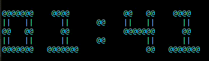

# Timer clock
Introducing a mighty small python app for those who sit for long time in front of computers. We tend to forget to stand up and do some stretching while sitting for long hours, especially in case of serious involvement. This application will remind you to do so by showing a live timer on your screen.
This app can be specifically useful for those who work in terminal since the app runs inside the terminal. 

**sample**

