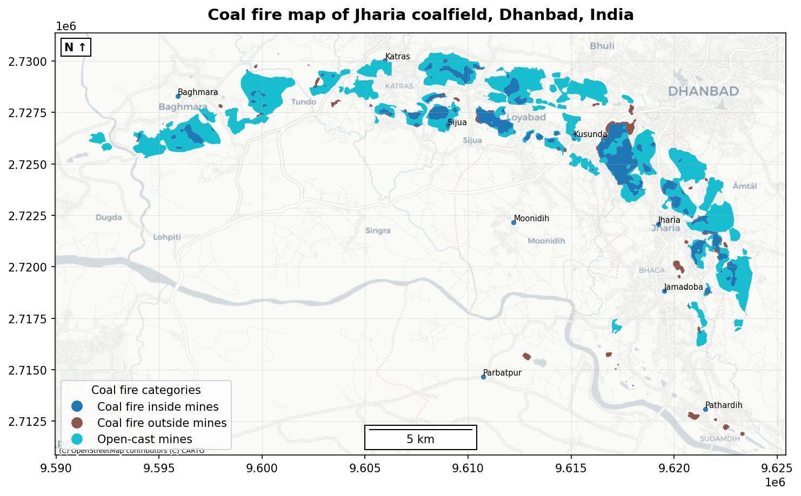

# Generic Mapper
This is an interactive generic mapping application that chat with the user, understand map requirements, and generate a ready-to-use map for the user. <br>



## Functionalities
### Interactive Chat Agent
The interactive program will initiate a chat agent that seek information from the user and instead of the user needing to make every map component individually and generate the map for the user. This application <b> doesn't require any coding background </b>since it is completely interactive. The user will not see any line of code once the chat agent is live!

### Map Customization
The chat agent generate an initial map, asks user for map styling modifications and generate a new map as per the user suggestions.

### KML Friendly
A non-geospatial user might get confused with the usage and creation of the usual shapefiles. Instead, the user-friendly GoogleEarth can be used to produce KML files that is readable in this application, avoid the geospatial knowledge dependancy. 

### Ready-to-use Map
The map generated by this application is ready-to-use for your presentation or journal article because it contains all necessary components a map should have, such as legends, markers, and scale.

### Basemap
A variety of basemaps to choose from and the chat agent will show you all options. <br>
If you are interested in adding more, refer [guideline](https://contextily.readthedocs.io/en/latest/intro_guide.html).

### Fine Tuning
The chat provides a wide variety of fine tuning elements to modify the map as per the user requirement. This include changing position of map elements such as Legend, Scale, and North arrow. Also, the basemap and layer styling (including the boundary lines) can be modified.

### Avoid Data Cumbersome
Selecting which layers to add or modify is very easy since the chat agent will guide you by showing all available options in all steps that includes choosing which layer to add to the map even without providing the full path of the file. Similary, it shows the layer applicable for a specific action, such as making custom annotation markes from point data.

### Sample Data
A set of sample data is provided and the guideline according to that specific data will show you how to utilize this application instead of figuring it out by yourself.

### Custom Projection
The application support custom project and on-the-fly coversions, making it even versatile. 

### Accept Hex Colors
If you want to provide a specific color instead of using generic wording, such as light blue, provide the hex value of the color you choose. 

## Execution steps
1. <b>Setup Python environment:</b> Execute the command below in a terminal/ command prompt <br>`pip install geopandas matplotlib contextily`

2. <b>Initiate the chat agent: </b>Execute the command below from base directory
<br>`python generic_mapper.py`

3. <b>Define data container:</b> Provide the full path of the folder containing your input data.

4. <b>Chat with the agent and generate initial map: </b> The agent will ask specific question to the user about what to perform. Then, it generates an initial map. 

5. <b>Modify the map:</b> Open the generate file `` The agent will be waiting for your further instruction about required modification from the initial image.

6. <b> Finalize:</b>: Finalize the map after all modifications with help of the chat agent.

## Example
Below is an example of the application using the data provided with this repo. The final map is what you are seeing on the top. 
<details>
<summary>Click to execution with sample data</summary>

```command prompt

easy_map_generation_application>python generic_mapper.py
=== Study Area Map Builder (menu-driven) ===

--> Enter the path to your data folder: Data

📂 Available spatial files:
  1. jcf_cf.shp
  2. jcf_locations.shp
You can refer to files by NUMBER or NAME in the next steps.


Add data:
  1. Add categorized spatial data
  2. Add uncategorized spatial data
  3. Done adding
--> Choose an option (1/2/3): 1
--> Enter filename or number for the categorized layer: 1

Available fields:
  1. Region
--> Choose field to categorize by (type number or value): 1
--> Legend title for this categorized layer (type 'None' to hide): Coal fire categories

Layer Added. Choose next option


Add data:
  1. Add categorized spatial data
  2. Add uncategorized spatial data
  3. Done adding
--> Choose an option (1/2/3): 2
--> Enter filename or number for the uncategorized layer: 2
--> Legend title for this layer (type 'None' to hide): none
--> Label points from an attribute (y/n): y
  1. Name
  2. altitudeMo
  3. begin
  4. descriptio
  5. drawOrder
  6. end
  7. extrude
  8. icon
  9. tessellate
  10. timestamp
  11. visibility
--> Choose label column (type number or value): 1

Add data:
  1. Add categorized spatial data
  2. Add uncategorized spatial data
  3. Done adding
--> Choose an option (1/2/3): 3
-->
Map title: Coal fire map of Jharia coalfield, Dhanbad, India
--> Do you want to change the current EPSG 4326 (y/n): n
✅ Map exported: generated_map.png

Modify map:
  1. Basemap
  2. Legend position
  3. Scalebar position
  4. North arrow position
  5. Colors for polygons/lines
  6. DPI & image size
  7. Line thickness (polygon outlines / lines)
  8. Done (regenerate & export)
--> Choose an option (1/2/3/4/5/6/7/8): 2

Choose legend position:
  1. upper left
  2. upper center
  3. upper right
  4. center left
  5. center right
  6. lower left
  7. lower center
  8. lower right
--> Pick a position (type number or value): 6

Modify map:
  1. Basemap
  2. Legend position
  3. Scalebar position
  4. North arrow position
  5. Colors for polygons/lines
  6. DPI & image size
  7. Line thickness (polygon outlines / lines)
  8. Done (regenerate & export)
--> Choose an option (1/2/3/4/5/6/7/8): 3

Choose scale bar position:
  1. upper left
  2. upper center
  3. upper right
  4. center left
  5. center right
  6. lower left
  7. lower center
  8. lower right
--> Pick a position (type number or value): 7

Modify map:
  1. Basemap
  2. Legend position
  3. Scalebar position
  4. North arrow position
  5. Colors for polygons/lines
  6. DPI & image size
  7. Line thickness (polygon outlines / lines)
  8. Done (regenerate & export)
--> Choose an option (1/2/3/4/5/6/7/8): 8
✅ Map exported: generated_map.png
✅ Map updated. Please check 'generated_map.png'.
-->
Do you want to make more modifications (y/n): n

🙏 Thanks for using Study Area Map Builder. Good luck!
```
